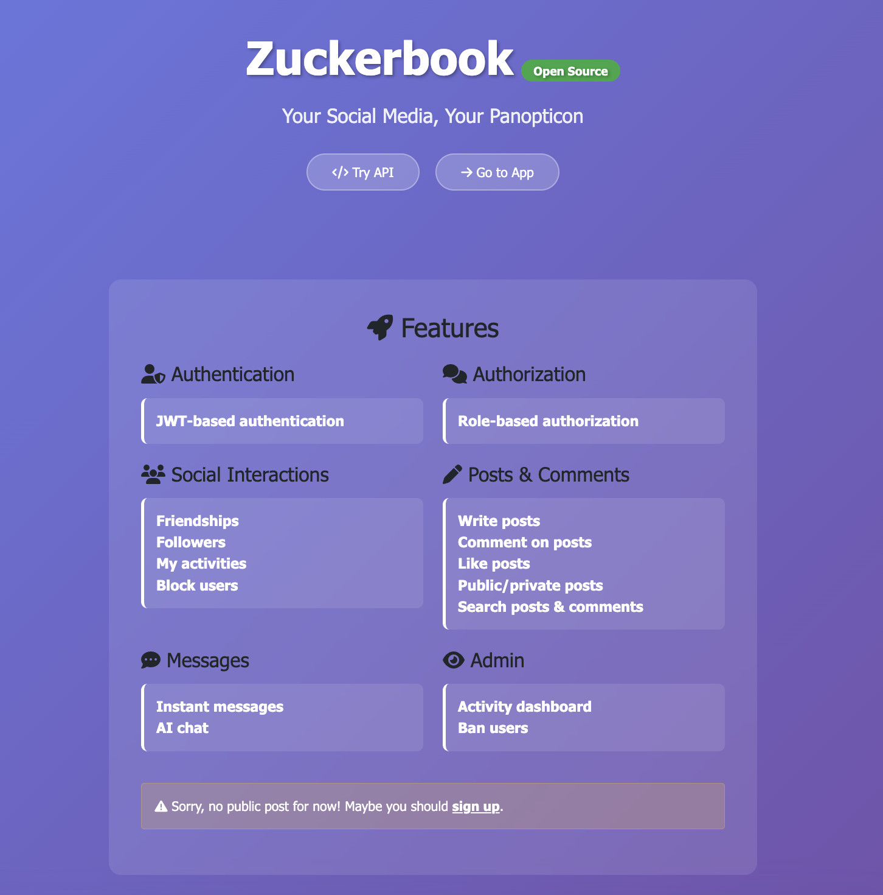
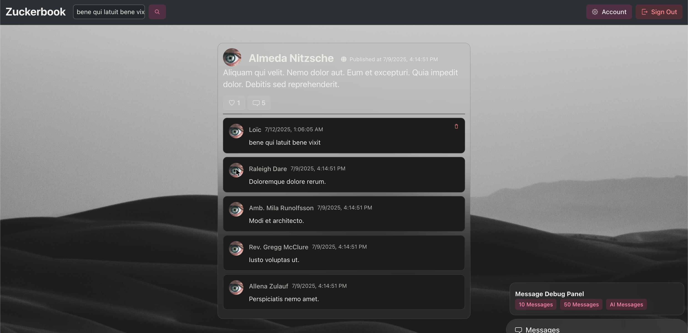
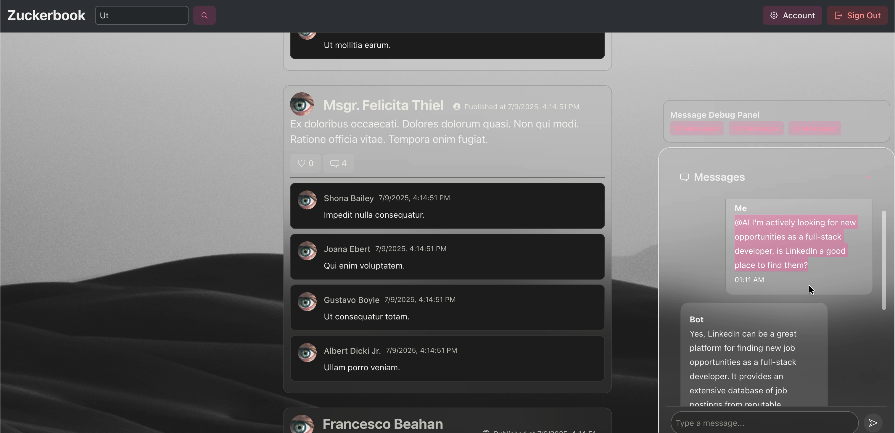

<div align="center">
<h1>👁️ Zuckerbook</h1>
<h6>A modern social media web app built with Rails and React</h6>
</div>



## Demo
#### Full-text search

#### AI chat

#### You likely wont' see this screen because the app loads blazingly fast (JK)


## Run the Project
### Prerequisites
- Ruby 3.4
- Rails 8.0
- Bun
- Redis
- Elasticsearch
- Ollama
- PostgreSQL (production only)
- Cloudinary Storage Space (production only)

### Setup
```bash
bundle install
bun install
rails db:create
rails db:migrate
bin/dev
```

## Things you should know first

* The app is built for monitoring users' daily activity.

* The app is well designeded for its admin to quickly ban any users.

* We are collecting data, DO NOT put any important data here.

## 簡介
一個以RoR寫出的開源社群軟體。
資料庫使用PostgreSQL，搜尋使用BonsaiElasticsearch，雲端儲存使用Cloudinary。
目前擁有的功能是：
1. 使用者帳戶（儲存大頭貼、基本資料）
2. 管理者後台（可以看到每個使用者的活動狀況，包括追蹤、加友和發布貼文的狀況）
3. 社群操作（追蹤、加友、喜歡貼文、評論）
4. 簡單的文章搜索（全文搜索，不包含評論的部份）
5. 簡單的文章權限（只分公開貼文，和限於註冊者的貼文）
6. 多重角色（最高管理者Zucker、管理者Admin、使用者Newbie、未註冊者）
7. 禁言功能（Zucker可隨時停止使用者發文的權限）
8. 註冊與刪除帳戶
9. 即時聊天室

尚在處理中的功能是：
1. 警告功能（Zucker可發訊息警告使用者）
2. 同意或拒絕交友請求
3. Zucker可觀看每個人的友誼關係圖表
4. 進一步的發文權限區別（例如好友貼文）
5. 聊天室歷史紀錄

## Developer Dairy
*201804xx
動工

*20180420
修改搜尋器（Solr->ElasticSearch）
修改資料庫（SQlite->PostgreSQL）
完成基本建置，完成第一次Heroku部署

*20180421
新增雲端儲存能力（Cloudinary）

*20180507
調整響應式設計，避免在不同裝置運行時會有的版面錯誤
新增聊天功能（ActionCable+RedisServer）

*20250705
Upgrade to Rails 8.0
